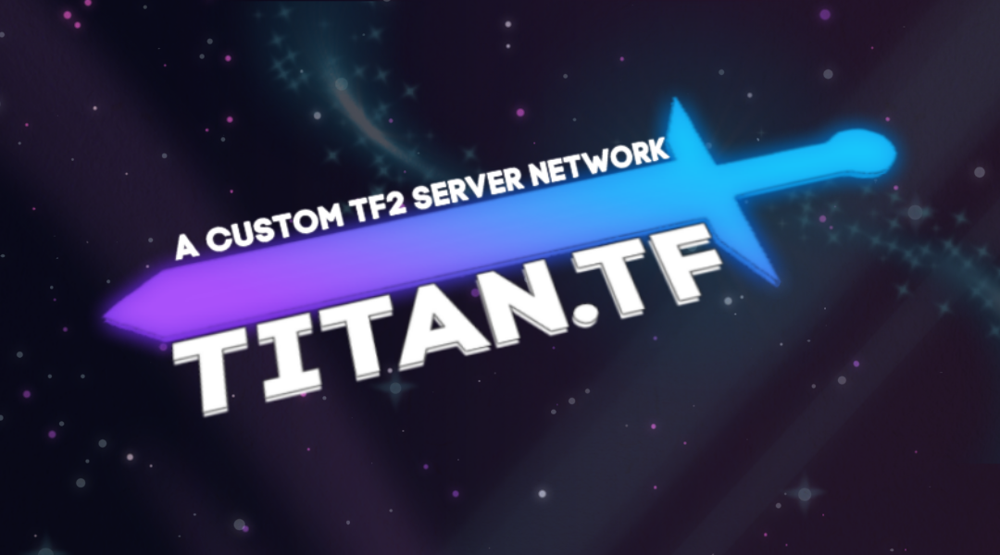

# The Universe

This library is the one stop place for everything Titan. Here you will discover the basics to get you started, as well as awesome features you will one day come across.

> This platform is created and maintained by the team. If you wish to make a modification, click the "Edit on GitHub" button on the top right of any page to create a Pull Request.

#### Disclaimer


While we try our best to keep this library of information up to date, you may find outdated information here. Please verify any information you find here before proceeding with any action.


## Updates

Titan regularly receives content and feature updates depending on ideas and issues that come about, which also includes bug fixes. There is no fixed interval between updates nor do we have an update release schedule.

There is a public facing bug and issue tracking platform which can also be used to make suggestions. We regularly monitor the platform for new discussions.

## Credits

> Icons used on this site are provided by [FlatIcon](https://flaticon.com).

