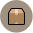
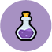
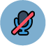

# FAQ

##  What are gems?

Gems are a powerful currency used on our servers. They drop to you for every 3 minutes spent on any server.

They can purchase all sorts of things from Titan credits to TF2 items. Check out the Gems Exchange with the link below to discover what you can do with gems.

##  How do I buy items?

Most items are purchasable with Titan credits.

Once you have Titan credits, you can either type `!shop` whilst in a server or visit the[ Item Shop](https://titan.tf/shop) on a browser to browse items.

##  I cannot buy anything from the item shop!

You have either not enough Titan credits to purchase the item you are trying to purchase, or you do not have enough space left in your backpack to store the new items.

Buy the Backpack Expander from the [Item Shop](https://titan.tf/shop) if you ran out of space.

##  The items I bought are not playing any sounds?

You have to install our custom content pack in order to hear custom sounds.

You can do so by clicking [here](steam://connect/download.titan.tf:11111) which will connect you to our content distributor server. The server will automatically install the content pack for you.

##  What are levels?

Levels are calculated from experience points you earn by playing on our servers. A wide range of activities from just playing, to winning a round, grants you experience points.

There are over 3000 levels that support level tiers, which are the level badge prefix beside your name.

##  What are chests?

Chests can only be obtained from leveling up. Certain event chests may be called a different name and can be obtain through other ways.

Opening a chest will grant you a random item from the pool of items the chest is assigned to.

##  How do I mute someone?

1. Press `Esc` to bring up the main menu while connected to a server. 
2. Click the mute players icon at the bottom of the screen \(Looks like an ear with an X in it\).  
3. Find the person's name.  
4. **Easy Mute**  
   Double-click their name.  


   **Bulk/Mass Mute**  
   1. Click on the player names you wish to mute while holding `CTRL`   
   2. Press `Mute in-game voice`

##  How do I disable voice chat?

1. Enable the developer console in your options.  
2. Press ``` ~`` tilde key on your keyboard. Found next to your `1` key. 
3. Type `voice_enable 0` into the console. 

##  How do I report somebody or a bug?

File a new report, or track your previous reports with the link below.

##  What is Titan Plus?

It is a donation-based program which provides donors with a large range of benefits that provide no competitive advantage against other players who do not have it.

It starts at a low price of 2 keys for every month of subscription, which is equivalent to $5 US dollars.

##  How do I apply for a moderating position?

Submit a new application, or track your previously submitted applications with the link below.

##  How do I use a promo code?

Enter it into the link above. Use promo code **UNIVERSE** to receive 100 gems!

