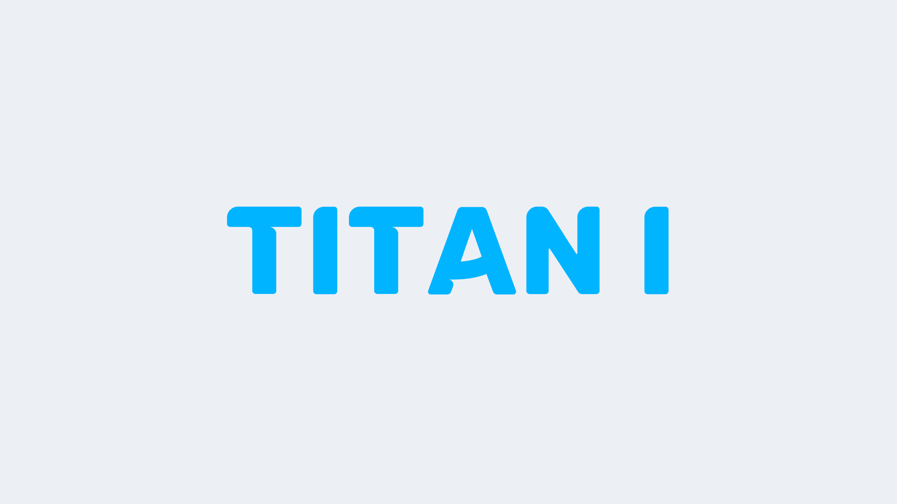

# Titan I

The first model hosted only 1 server, found right at the founder's home and it was not possible to keep it up and running 24 hours a day. The idea originally came from bringing Mann vs Machine x10 servers to Asia as there were none back then.

Crazier stuff was added overtime, ones that were released by other developers. This brought a large attention and became a very popular Mann vs Machine server.

**The exact founding date of titan.tf is unknown, but it is generally assumed to be the same date as the Steam group's creation.**

