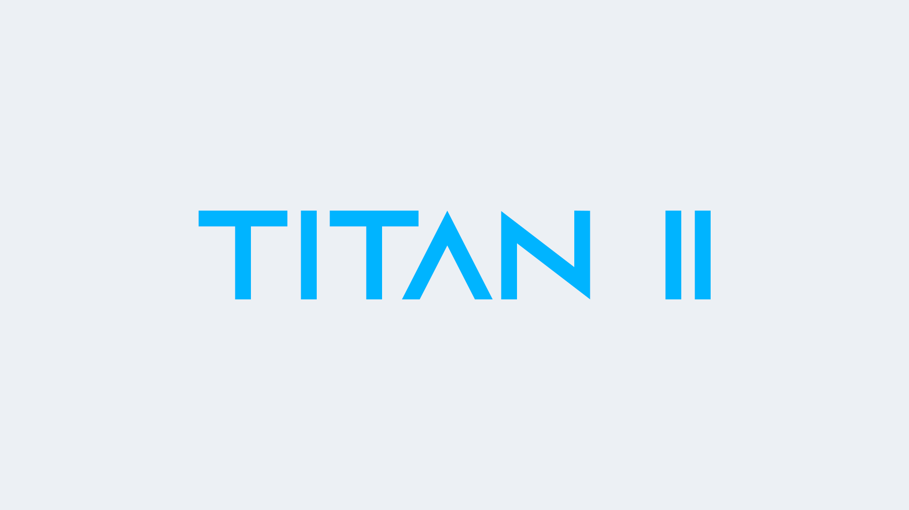

# Titan II

This era saw massive interface changes in the general server chat color scheme and menus to name a few. This was when we started picking up Sourcepawn coding, where we introduced advanced expandable menus, timers, panels, etc and made the MvM server a competitive mode with those timers he made.

This was the most important era of Titan's evolution because this was what drove us towards the path we are currently on. We also started experimenting with cool ideas such as events and gifts.

We also started adding more and more maps and missions, now with an insane collection of EVERY properly working MvM maps available in the game that have been publicly released. We wanted to keep players fresh with what they are playing, instead of playing the same content over and over again. Today, you can play more than 1,000+ missions on our servers, which would take more than 3 years if you were to try one of them each day.

However, this was when we started facing a serious issue. The more maps, the more bandwidth the download \(a.k.a FastDL\) server has to consume. Ours was hosted on a free site back then, so bandwidth and space were limited. We had to continuously create new accounts on the provider because the bandwidth was always exceeding in the free plan, but we really had no choice.

