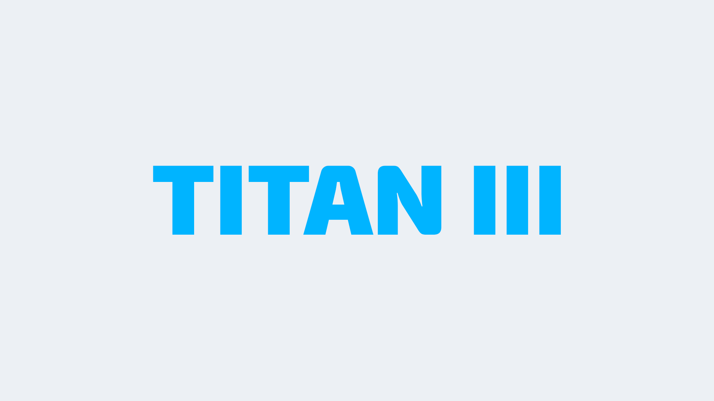

# Titan III

Massive improvements were brought based on Titan II. Menus were improved and chats displayed more relevant content. This is also when they had enough funds to host more servers that were providing better latency and available 24 hours everyday, thanks to our dedicated players who kept playing and supporting the server. They had a lot of gamemodes planned to create, but they started off with 11 MvM servers.

From there, they gathered even more funds to host a fast download server that has unlimited bandwidth, which meant that they could start to host more maps for gamemodes of all types.

