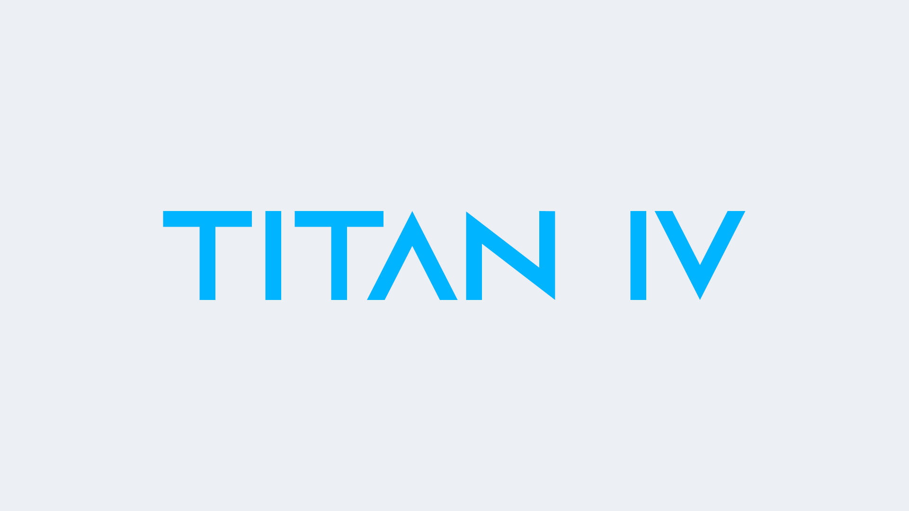

# Titan IV

This brought massive fixes to changes that were carelessly made in Titan III. We started off making a Free-for-All Hightower Deathmatch server but it never really got popular, so we scrapped it off the list.

We then started introducing Hightower, followed by Orange, and these are very welcomed by players in Asia. After that, we worked on Deathrun. The Deathrun server has a heavily modified version of Deathrun Redux, to follow the Vs Saxton Hale Deathrun concept but without the need to download the other boss models so that players can join the server quick, but the main plugin many more fixes to come.

