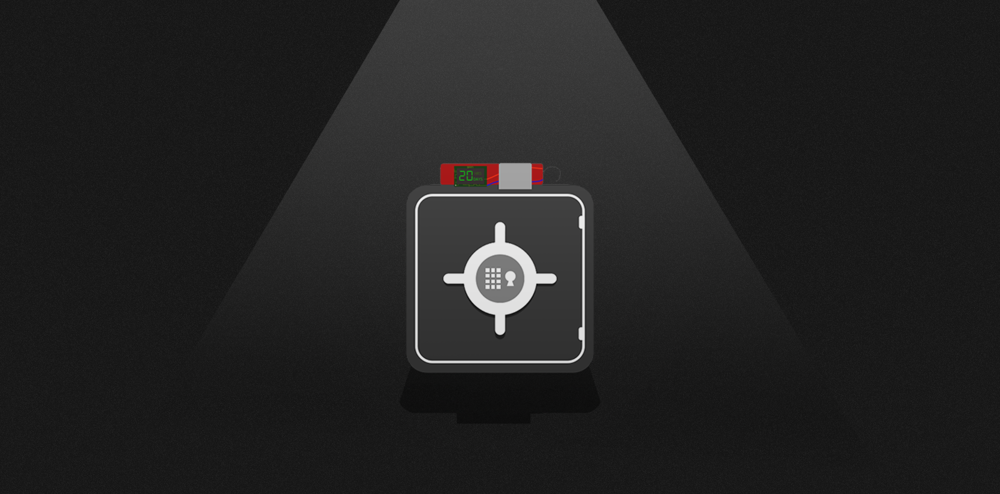

# Break the Safe

"Break the Safe" is the first massive ARG \(alternate reality game\), and story driven event. The event came with a teaser and a trailer, along with multiple progression of events.

### Event

This was a message relayed from Team Titan to the Grand Council after discovering a locked safe in Sexton Co.

"Team Titan here, we have successfully intruded Sexton Co. and we found a safe estimated to be worth $10,000"

"The safe is locked however. It requires a key and a 5 digit pin to unlock it."  
— Message from Team Titan \(Elite Division of GC\) to Grand Council

### Story Progression

The Grand Council has intruded into the domains of Sexton Co. and is greeted by a safe estimated to be worth $10,000. The safe is locked and requires a key and a 5 digit pin to unlock it.

The team had attempted to input a random number without a key and has accidentally activated its self defense mechanism, a bomb.

A timer attached to the bomb displayed 20:00:00:00.0 and started counting down. The safe is assumed to be set to explode 20 days from now. The team is determined to break open the safe after coming this far, and is seeking help from agents to unlock it.

The Grand Council has tasked agents around the world to gather as many keys as possible and guess the 5 digit code to unlock it, the winner will receive the money in the safe. You are tempted to be the one to unlock the safe and want to hunt down as many keys as you can find to stand a chance of winning the big prize in it. You registered yourself as an agent, and the story begins.

