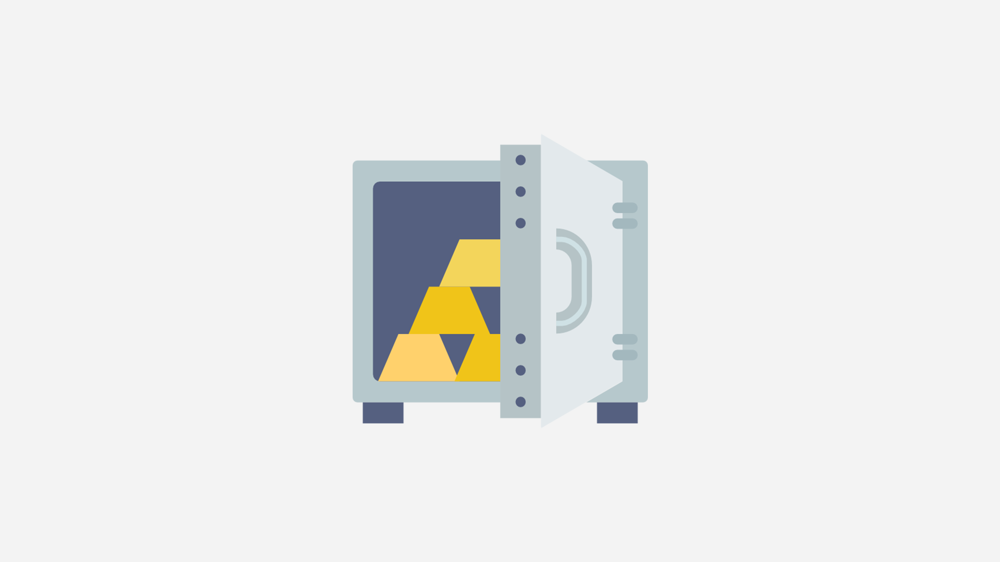

# Bank

The bank is a 3rd party inventory that facilitates all item exchanges except trading and the black market. Any item that will be [given away](../giveaways.md) or [deposited into casino games](../casino/) must be inside the bank. All items won from casino games and giveaways are automatically transferred into winner's bank.

Items can be transferred in and out of the bank easily. There is no limit to the number of items that can be stored in the bank, nor is there a limit to the number of items exchangeable in one transfer.

### Private Banks

Bank inventories are private, only the player who owns it can view and transfer items in and out of it. There is no way to see the items in another player's bank.

