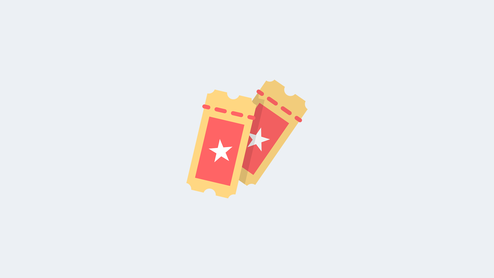
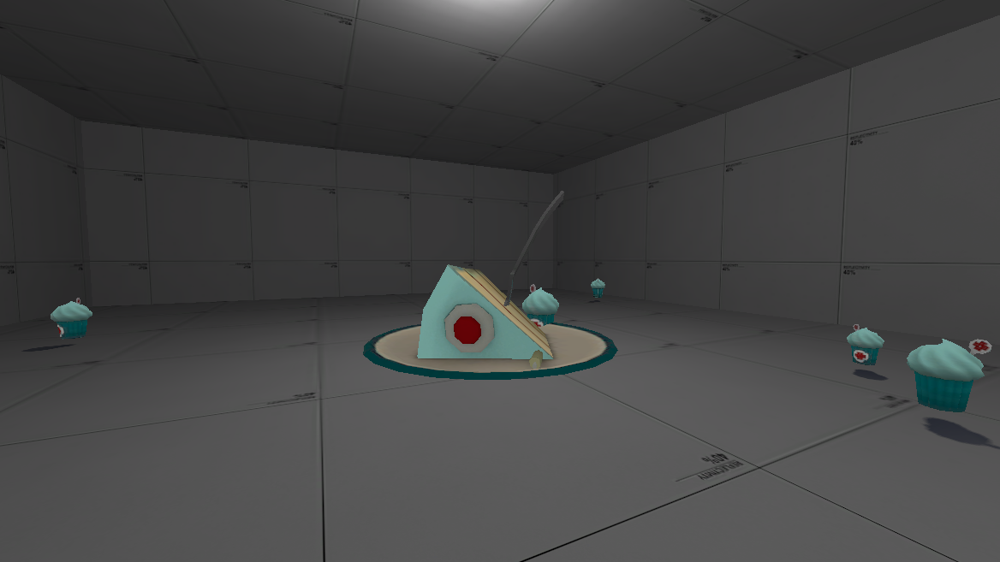

# Battle Pass

The first battle pass was introduced in the Killing Camp update. A pass allows for a new way of earning items rather than paying for them with credits.

Through progressively completing daily quests and leveling up, players are able to level up their battle pass and earn items throughout a battle pass.

###  Tour of Destruction Battle Pass

A special battle pass that does not feature any items, and only Acrylic weapons and Winter 2018 chests. The weapons earned increases in size when the battle pass leveled up.

###  Killing Camp Battle Pass

Items Available: **255**

