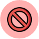

# Black Market

The black market is an item exchange market where players can put up their items for sale at any price they want, or buy items from the market for possibly a cheaper price than what the item shop offers.

###  Limits

You can only sell your items for less than 2X of the original item price. This limit does not apply to items with no value.

### Listings

You can track the items you have listed on the black market, and take them down anytime you would like if you changed your mind.

