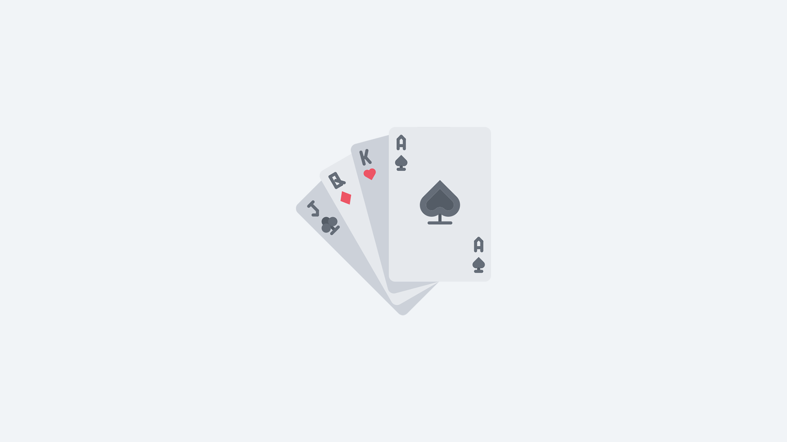

# Casino

## Servers

Games that are only playable on community servers.

### Jackpot

The very first casino game introduced was jackpot. Players can deposit any amount of credits to enter the pot, and the winner takes the entire pot home.

The higher the amount deposited by a player, the higher the chance they have to win the pot. The pot starts picking the winner 15 seconds after there are at least 2 players in the pot. The pot resets its timer back to 15 seconds when another player joins the pot.


Only 1 jackpot game can be active at any one point in time.


|  |  |
| :--- | :--- |
| **Players** | 2 - 32 |
| **Game Type** | Party |
| **Entry Type** | Credit Betting |
| **Winners** | 1 |
| **Min. Bet** | $0.10 |
| **Max. Bet** | $5,000 |

### Towers \(Discontinued\)

Bet any amount of credits, avoid the bomb and climb to the last level of the tower to win. The number of levels vary depending on the amount you bet.

You can bail the tower with your current winnings any time you wish, if you think you've collected enough winnings.

|  |  |
| :--- | :--- |
| **Players** | 1 |
| **Game Type** | Solo |
| **Entry Type** | Credit Betting |
| **Winners** | 0 or 1 |
| **Min. Bet** | $0.10 |
| **Max. Bet** | $500 |

## Website

Games that are only playable on the website.


Items must be transferred from the inventory into the [bank](bank/) in order to deposit items into web-based casino games.


### SUPER JACKPOT!

Added in [Patch 2.0.54](https://steamcommunity.com/groups/titantf/discussions/11/1732087824993135379/), it is a large scaled version of the classic jackpot casino game. Deposit items instead of money. 

Rolls every half hour or when the pot exceeds 500 total items.

| \*\*\*\* |  |
| :--- | :--- |
| **Players** | ∞ |
| **Game Type** | Mega Party |
| **Entry Type** | Item Betting |
| **Winners** | 1 |
| **Min. Bet** | 1 Item |
| **Max. Bet** | 50 Items |

### Break the Safe

Added in [Patch 2.0.53](https://steamcommunity.com/groups/titantf/discussions/11/1732087824985810792/), it was to build on the potential of a massive ARG in 2017, called "Break the Safe".

Everyone can guess the PIN once every 10 minutes for free. The base safe contains $1,000 and increases by $100 to $200 every 1 hour. It increases by $5 for every failed attempt.


What happens when it is OPENED by someone?The person who manages to open it secures all the loot inside the safe.



What happens when it is NOT OPENED? The safe explodes when it reaches $50,000 and spawns a new one which resets the value back to $1,000.


| \*\*\*\* |  |
| :--- | :--- |
| **Players** | ∞ |
| **Game Type** | Mega Party |
| **Entry Type** | Free |
| **Winners** | 1 |
| **Min. Bet** | - |
| **Max. Bet** |  - |

### Lottery

Added in [Patch 2.0.56](https://steamcommunity.com/groups/titantf/discussions/11/1732087825000440286/), lotteries are a big pool of prizes drawn weekly every Sunday at 12 AM Singapore Time \(SGT\).

Earn lucky coins from playing, killing opponents, winning rounds and searching supply drops. Use lucky coins to buy tickets from the [lottery](https://titan.tf/lottery).

| \*\*\*\* |  |
| :--- | :--- |
| **Players** | ∞ |
| **Game Type** | Mega Party |
| **Entry Type** | Lucky Coins |
| **Winners** | 1 |
| **Min. Bet** | 1 Lucky Coin |
| **Max. Bet** | ∞ |

### Coinflips

Added in [Patch 2.0.55](https://steamcommunity.com/groups/titantf/discussions/11/1732087824996912305/), coinflips offer the first ever duel casino game.

Anyone can create a coinflip for someone else to join, and anyone can join somebody else's open coinflips by depositing items of equal value to the coinflip.


The participant has to deposit items of value within the range of 3% lower and 3% higher of the host's item value.


**Coinflip results are announced live.** As soon as someone joins your coinflip, the winner selection animation will begin \(_if you are spectating the coinflip_\).

<table>
  <thead>
    <tr>
      <th style="text-align:left">&lt;b&gt;&lt;/b&gt;</th>
      <th style="text-align:left"></th>
    </tr>
  </thead>
  <tbody>
    <tr>
      <td style="text-align:left"><b>Players</b>
      </td>
      <td style="text-align:left">2</td>
    </tr>
    <tr>
      <td style="text-align:left"><b>Game Type</b>
      </td>
      <td style="text-align:left">Duel</td>
    </tr>
    <tr>
      <td style="text-align:left"><b>Entry Type</b>
      </td>
      <td style="text-align:left">Item Betting</td>
    </tr>
    <tr>
      <td style="text-align:left"><b>Winners</b>
      </td>
      <td style="text-align:left">1</td>
    </tr>
    <tr>
      <td style="text-align:left"><b>Min. Bet</b>
      </td>
      <td style="text-align:left">
        
<b>Host: </b>1 Item

        
<b>Participant: </b>Items of &lt;= 3% equivalent value of the coinflip
          host items

      </td>
    </tr>
    <tr>
      <td style="text-align:left"><b>Max. Bet</b>
      </td>
      <td style="text-align:left">
        
<b>Host: </b>&#x221E; Items

        
<b>Participant: </b>Items of &gt;= 3% equivalent value of the coinflip
          host items

      </td>
    </tr>
  </tbody>
</table>## Provably Fair

The provably fair system **only supports web-based casino games**. The goal of this system is to ensure the integrity of the result.

### How It Works

* A server seed, public seed and the result is generated at the start of every round
* A sha256 hash is generated based on the `seeds, the result and the round number`
* The `hash` and `public seed` is visible to the everyone from the start of the round
* The hash can then be used to verify that the result was never changed \(_by regenerating a hash based on the seeds, result and round number\)_


If the hash given at the start of the round and the hash generated after the round **MATCHES**, the round is verified to be legitimate and not manipulated. 🔑


**All web-based games are supported except lottery.** An attempt was made to implement this to the lottery system at launch, but was not viable due to the way the participant pool works.

