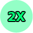

# Gems

Introduced in [Patch 1.184](https://steamcommunity.com/groups/titantf/discussions/11/1694914735999869211/), gems is a very powerful currency. It can be used to buy all sorts of things at the gems exchange.

Players receive 1 gem every minute for playing on community servers.


This currency does not drop by default. To replace your credit drops with gem drops, modify your [settings](https://titan.tf/settings).


##  Weekend Multiplier

If you have **titan.tf** in your name, you will receive a 2X gems drop boost during the weekend.

##  TWILIGHT Hours

All XP and Gems earned is quadrupled by 4X when playing from 12 AM to 9 AM on any day.

##  Gems Exchange

<table>
  <thead>
    <tr>
      <th style="text-align:center">You Give</th>
      <th style="text-align:center">You Get</th>
    </tr>
  </thead>
  <tbody>
    <tr>
      <td style="text-align:center">1 &#x1F48E;</td>
      <td style="text-align:center">$0.30</td>
    </tr>
    <tr>
      <td style="text-align:center">100 &#x1F48E;</td>
      <td style="text-align:center">1 Scrap Metal
         TF2 Item</td>
    </tr>
    <tr>
      <td style="text-align:center">900 &#x1F48E;</td>
      <td style="text-align:center">1 Refined Metal</td>
    </tr>
    <tr>
      <td style="text-align:center">1000 &#x1F48E;</td>
      <td style="text-align:center">1.11 Scrap Metal</td>
    </tr>
    <tr>
      <td style="text-align:center">1 Refined Metal</td>
      <td style="text-align:center">900 &#x1F48E;</td>
    </tr>
    <tr>
      <td style="text-align:center">5 Refined Metal</td>
      <td style="text-align:center">4,500 &#x1F48E;</td>
    </tr>
    <tr>
      <td style="text-align:center">10 Refined Metal</td>
      <td style="text-align:center">9,000 &#x1F48E;</td>
    </tr>
    <tr>
      <td style="text-align:center">30 Refined Metal</td>
      <td style="text-align:center">27,000 &#x1F48E;</td>
    </tr>
    <tr>
      <td style="text-align:center">3 Refined Metal</td>
      <td style="text-align:center">
        
$810 (+$190 bonus)

        
$1,000

      </td>
    </tr>
    <tr>
      <td style="text-align:center">8 Refined Metal</td>
      <td style="text-align:center">
        
$2,160 (+$340 bonus)

        
$2,500

      </td>
    </tr>
    <tr>
      <td style="text-align:center">15 Refined Metal</td>
      <td style="text-align:center">
        
$4,050 (+$950 bonus)

        
$5,000

      </td>
    </tr>
    <tr>
      <td style="text-align:center">24 Refined Metal</td>
      <td style="text-align:center">
        
$6,480 (+$1,020 bonus)

        
$7,500

      </td>
    </tr>
    <tr>
      <td style="text-align:center">30 Refined Metal</td>
      <td style="text-align:center">
        
$8,100 (+$1,900 bonus)

        
$10,000

      </td>
    </tr>
    <tr>
      <td style="text-align:center">7,500 &#x1F48E;</td>
      <td style="text-align:center">Small EXP Pack</td>
    </tr>
    <tr>
      <td style="text-align:center">15,000 &#x1F48E;</td>
      <td style="text-align:center">Medium EXP Pack</td>
    </tr>
    <tr>
      <td style="text-align:center">30,000 &#x1F48E;</td>
      <td style="text-align:center">Large EXP Pack</td>
    </tr>
    <tr>
      <td style="text-align:center">50,000 &#x1F48E;</td>
      <td style="text-align:center">Super EXP Pack</td>
    </tr>
    <tr>
      <td style="text-align:center">100,000 &#x1F48E;</td>
      <td style="text-align:center">MEGA EXP Pack</td>
    </tr>
  </tbody>
</table>

