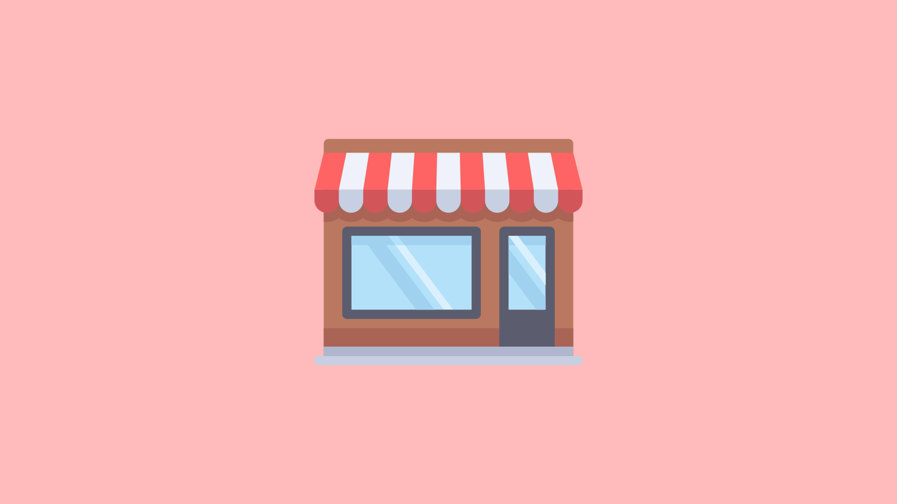
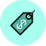

# Shop

## Servers

###  Buying items

You can buy items from the shop by typing !shop in chat while playing on a server. This command will draw a menu with multiple item categories.

Selecting a category will draw a list of items in that category. You can always press 8 \(back\) to return to the category list.

You can select an item in the item listing menu to view more information on the item such as its description and pricing.

###  Blocked Buttons

If the purchase button is blocked out for any of the purchase types, it means that you do not have enough Titan credits to grab that deal.

## Website

## 

