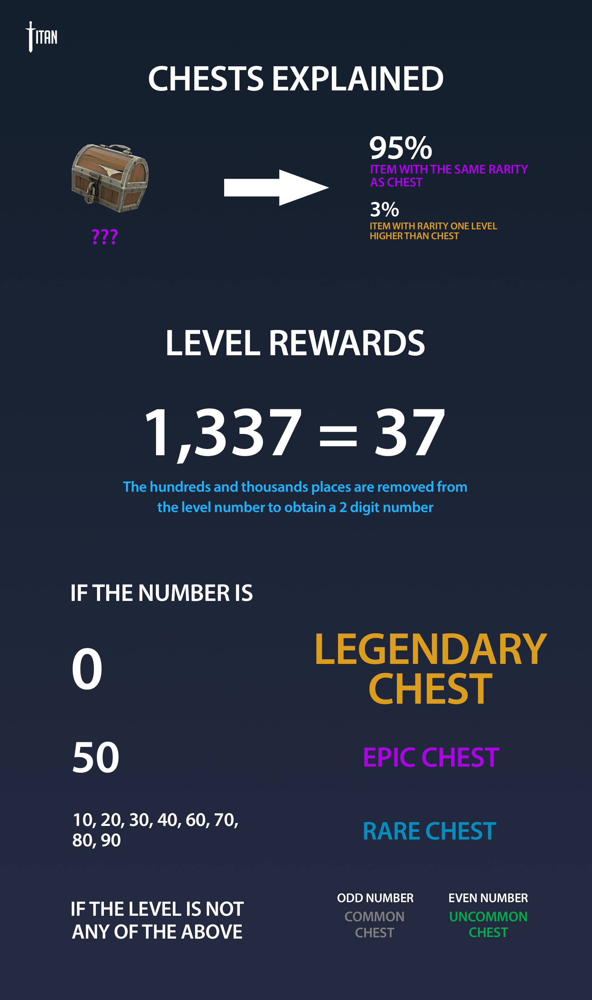

# Chests

Opening a chest gets you a random item from the game. Normal chests have 5 rarities available; **Common, Uncommon, Rare, Epic, and Legendary**. There are no Mythic chests.

### \*\*\*\* **Availability**

Chests can be obtained from leveling up. Event chests may be available through promotions.

###  Chest Drops

When normal chests drop upon leveling up, the rarity of the chest is determined by the new level number.

The hundreds and thousands places are removed from the new level number to obtain a 2 digit number. The 2 digit number is used to determine the chest rarity.

| Chest Rarity | Levels |
| :--- | :--- |
| Legendary | 0 |
| Epic | 50 |
| Rare | 10, 20, 30, 40, 60, 70, 80, 90 |
| Uncommon | 2, 4, 6, 8, 12, 14, 16, 18, 22, 24, 26, 28, 32, 34, 36, 38, 42, 44, 46, 48, 52, 54, 56, 58, 62, 64, 66, 68, 72, 74, 76, 78, 82, 84, 86, 88, 92, 94, 96, 98 |
| Common | 1, 3, 5, 7, 9, 11, 13, 15, 17, 19, 21, 23, 25, 27, 29, 31, 33, 35, 37, 39, 41, 43, 45, 47, 49, 51, 53, 55, 57, 59, 61, 63, 65, 67, 69, 71, 73, 75, 77, 79, 81, 83, 85, 87, 89, 91, 93, 95, 97, 99 |

##  Opening Chests

The chest's rarity determines the rarity of the item output from the chest. If the chest is a legendary, the item will be a guaranteed legendary rarity item.

There is a **3%** chance that the item that comes out of a chest is 1 rarity higher than the chest's rarity. This applies to all chest rarities except for Legendary, as Mythic items cannot be obtained through opening chests.

| Chest Rarity | 97% Chance | 3% Chance |
| :---: | :---: | :---: |
| Common | Common | Uncommon |
| Uncommon | Uncommon | Rare |
| Rare | Rare | Epic |
| Epic | Epic | Legendary |
| Legendary | Legendary | Legendary |

### **For Servers**

Only 1 chest can be opened at any one point in time. While a chest is being opened, another chest cannot be opened at the same time.

Open a chest by typing !chests or finding it in your !backpack, then select the chest you want to open and select **Use**.

**Opening chests in game provides a chest opening animation and sound.**

### **For Website**

Multiple chests can be opened at the same time. If you want to mass open chests, this is the way to go. 

Click on a chest to open it, and use the mass chest opening tool to automatically open hundreds of chests at once.

**Opening chests on the website instantly presents the item unboxed.**

##  Event Chests

| Event Chest | Availability |
| :--- | :--- |
| Possessed Chest | Grand Quest \(2017\) Tour of Destruction \(2018\) |
| Summer Wars 2017 Chest | Summer Wars \(2018\) |
| Nice Winter Chest 2017 | Santa's Lottery Race \(2017\) |
| Naughty Winter Chest 2017 | Santa's Lottery Race \(2017\) |

