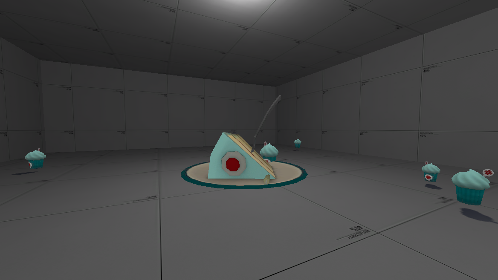

# Automated Season Events

There are many wonderful seasons over every year, for example spooky Halloween and joyful Christmas.

In order to create an atmosphere that strikes you the vibes of the season, we went ahead to modify some gameplay features to fit the theme.

These features are automatically enabled during each season.

## April Fools

For the lols.  
**1 April - 8 April \(7 days\)**

### Supply Drop

This is a special drop that is unique to this event. A bomb will randomly appear on the map. This bomb will detonate and annihilate everyone on the map if it is not destroyed within 5 minutes.



### Supply Chest

### Googly Eyes

### Projectiles

This feature only lasts for 1 day till 2 April. This feature is not available on Dodgeball servers.

#### Stickybombs appear as bombs.

#### Rockets can appear as a cow, Heavy or G-Man.

## Founder's Birthday

Celebrate the birthday month of our Founder.  
**1 August - 31 August \(30 days\)**

### Supply Drop

### Supply Drop Fragment

### Supply Chest

### Cash

### Gems

### Bomb

### Robots

## Halloween

The scariest one of them all!  
**1 October - 7 November \(37 days\)**

### Supply Drop

### Supply Drop Fragment

### Supply Chest

### Cash

### Gems

### Bomb

### Robots

### Halloween Spells

All Team Fortress 2 Halloween weapon spells will be activated on every weapon automatically.

### Projectiles

This feature only lasts for 2 days till 3 October. This feature is not available on Dodgeball servers.

**Rockets appear as pumpkins.**

## Christmas

It's the most wonderful time of the year!  
**25 November - 5 January \(41 days\)**

### Supply Drop

### Supply Drop Fragment

### Supply Chest

### Cash

### Gems

### Bomb

### Robots

### Snowy Weather

Only activates from 10 December to 1 January.

